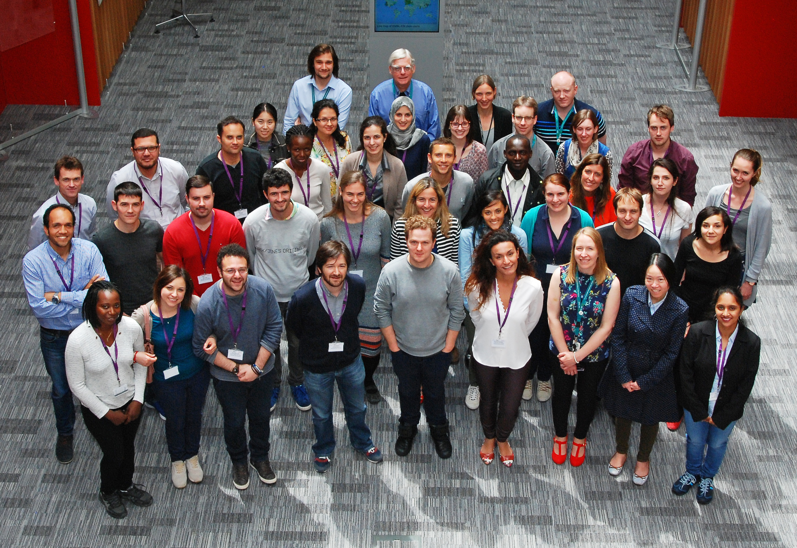

# EBI Summer School in Bioinformatics 2016

##### Lab Notes by Marek Kultys

These are lab notes taken during the EBI Summer School in Bioinformatics in 2016. The notes cover the work for the genome assembly project.

### NOTES ON THE NOTES

**Equipment**
These notes are made with MacOSX users in mind, although most of the actions should be applicable to any UNIX user.

**License and Liability**
These notes are licensed under the [CC-BY-4.0](https://creativecommons.org/licenses/by/4.0/) Creative Commons Attribution 4.0. You can share and remix these notes for any purpose provided that you give appropriate credit, share using the same license, and indicate any changes made. These notes are shared 'as they are'. The author provides no warranty for the accuracy of these notes and accepts no liability or responsibility for any loss or damage done due to the use of these notes.

---

**Genome Assembly project** is inspired by [this paper](http://www.pnas.org/content/109/8/3065.full.pdf) reporting on the E. Coli outbreak in Germany and France in 2011. We will be using the data produced by the team behind the paper. Project outline available online on [EBI Summer School Google Folder](http://goo.gl/m7F6rT).

---

### List of Contents:

[1. De-Novo_Assembly](De-Novo_Assembly.md)

[2. Mapping_Assembly_with_Reference](Mapping_Assembly_with_Reference.md)

[3. Genome_Annotation](Genome_Annotation.md)

[4. Finding_Variants_in_Genes](Finding_Variants_in_Genes.md)

Photo by EBI
